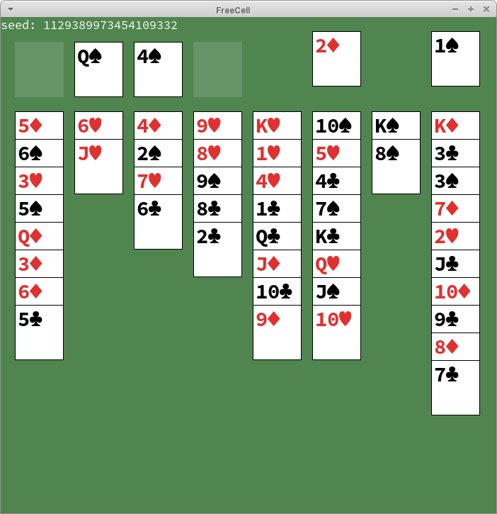

# FreeCell

This is a simple implementation of the FreeCell solitaire game in Rust using SDL2.

Use the mouse to drag and drop cards.
Undo your moves with `Backspace` or `U` and redo them with `Enter` or `R`.
Copy the seed to your clipboard using `C`.
Save the game state using `S`.

By default, the seed used to shuffle the deck is randomly chosen.
In order to play using a specific seed, pass it in using the `-s/--seed` flag on the command line, as in `./freecell -s 12345678`.
To load a saved game, provide the filename with the `-l/--load` flag.
